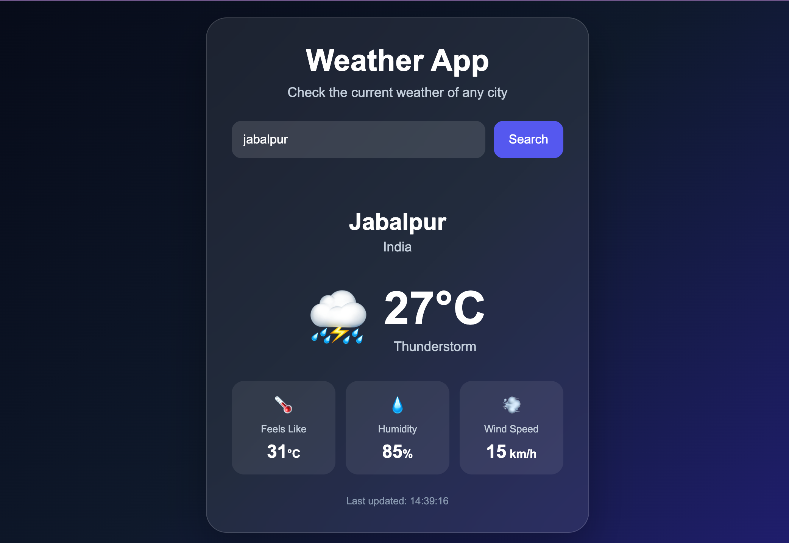

# 🌦️ Weather App

A modern and responsive Weather App built using **HTML, CSS, and JavaScript**.

The application allows users to search for any city and view its current weather information, including temperature, feels-like temperature, humidity, wind speed, and weather conditions.

The app uses the **Open-Meteo API** to fetch real-time weather data and the Open-Meteo Geocoding API to convert city names into geographical coordinates.

---

## 🚀 Live Demo

🔗 **Live Website:**  
https://weather-app-mocha-eight-19.vercel.app/

---

## 📸 Preview



---

## ✨ Features

- 🔍 Search weather by city name
- 🌡️ Current temperature
- 🌡️ Feels-like temperature
- 💧 Humidity information
- 💨 Wind speed
- ☀️ Dynamic weather icons
- 🌧️ Weather condition detection
- ⚠️ Error handling for invalid cities
- ⏳ Loading indicator
- ⌨️ Search using the Enter key
- 📱 Fully responsive design
- 🎨 Modern glassmorphism UI
- 🌐 Real-time weather data
- 🔑 No API key required

---

## 🛠️ Technologies Used

### Frontend

- HTML5
- CSS3
- JavaScript (ES6+)

### API

- Open-Meteo Geocoding API
- Open-Meteo Weather API

### Deployment

- Vercel

### Version Control

- Git
- GitHub

---

## 📂 Project Structure

```text
Weather-App/
│
├── index.html
├── style.css
├── script.js
├── Screenshot.png
└── README.md
